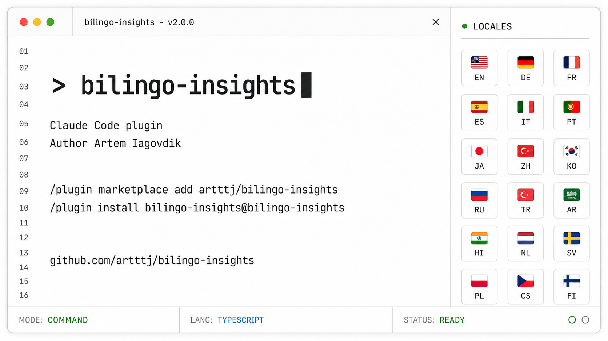

# bilingo-insights

[](LICENSE)  



Multilingual explanatory insights for Claude Code. Each insight shows up once per
language you pick, stacked. By default you get English then German.

## Quick start

```
/plugin marketplace add artttj/bilingo-insights
/plugin install bilingo-insights@bilingo-insights
```

Restart Claude Code. That's it. Insights now come in English and German.

Want a different language? Set one variable:

```
export INSIGHTS_LANG=de        # German only
export INSIGHTS_LANG=en,fr     # English, then French
export INSIGHTS_LANG=en,de,fr  # English, German, French
```

The rest of this page is detail you only need if you want it.

## What it looks like

Say an insight about floating-point math comes up while Claude works on your
task. With the default `en,de`, it arrives as two stacked boxes, the same points
in each language:

```
★ Insight ──────────────────────────────────────────────────
- 0.1 + 0.2 isn't 0.3 in most languages. You get 0.30000000000000004,
  because floats store decimal fractions as binary approximations.
- So comparing two floats with == is a trap. Check that the difference is
  smaller than a tiny epsilon instead.
- It also means order matters when you add many small floats. Sum them in a
  different order and the total can come out slightly different.
──────────────────────────────────────────────────────────────
★ Einblick ─────────────────────────────────────────────────
- 0.1 + 0.2 ist in den meisten Sprachen nicht 0.3. Du bekommst
  0.30000000000000004, weil Floats Dezimalbrüche als binäre Näherung speichern.
- Zwei Floats mit == zu vergleichen ist deshalb eine Falle. Prüfe stattdessen,
  ob die Differenz kleiner als ein winziges Epsilon ist.
- Auch die Reihenfolge zählt, wenn du viele kleine Floats addierst. In anderer
  Reihenfolge kommt ein leicht anderes Ergebnis heraus.
──────────────────────────────────────────────────────────────
```

Want German only? Set `INSIGHTS_LANG=de` and you get just the `★ Einblick` box,
same points, no English in the way. Want a third language? `en,de,fr` stacks an
`★ Aperçu` box under the German one.

## Why you might want it

- Your Claude Code is in English but you think in another language. Set
  `INSIGHTS_LANG` to your language alone and the point lands in your head faster,
  with no English box you don't need.
- Read insights in your mother tongue while keeping the English. Use `en,xx` and
  the idea sits right next to the English the rest of the field uses.
- Learn a language while you code. Point it at one you are learning. You already
  read code for hours, so now every insight comes with its translation and you
  pick up real technical vocabulary in context.

## How it works

A SessionStart hook adds an instruction to the session that asks Claude to write
each insight in the languages you listed, in order. The first language is the
canonical insight, the rest are translations of it. Nothing runs against your
code, and there is no translation service. Claude writes every language itself.
It's the same mechanism as the official explanatory-output-style plugin, just
with a multilingual instruction.

## Choose the languages

`INSIGHTS_LANG` is a comma-separated list of language codes or names. Order
matters. The first one is the canonical box. The default is `en,de`.

Set it in your shell profile, or in Claude Code `settings.json`, which works the
same across shells:

```json
{
  "env": {
    "INSIGHTS_LANG": "en,de,fr"
  }
}
```

A few ways to set it:

- `de` for German only, no English box.
- `en,de` for English then German. This is the default.
- `en,de,fr` for three boxes: English, German, then French.
- `fr,en` to put French first as the canonical box and English second.

Codes like `de`, `fr`, `es`, `it`, `pt`, `nl`, `pl`, `ru`, `uk`, `zh`, `ja`,
`ko`, `tr`, `ar` map to their language names. Anything else passes straight
through, so `INSIGHTS_LANG=Swedish` also works. Repeats are dropped, so `en,en`
gives one box.

## A note on cost

Each language adds another copy of the insight, and translated text often runs
longer than English (German especially). Two languages roughly doubles the
length, three roughly triples it. If token use matters to you, keep the list
short or use the single-language explanatory plugin instead.

## License

MIT. See [LICENSE](LICENSE).
